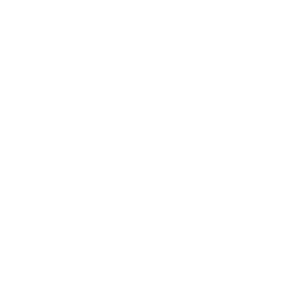

<style>
:root {
    --background-light: #fff;
    --background-dark: #333;
    --text-light: #000;
    --text-dark: #fff;
}

/* Default dark mode styles */
body {
    background-color: var(--background-dark);
    color: var(--text-dark);
}

/* Inherit color for all text elements */
body * {
    color: inherit;
}

/* Explicit dark mode styles for links and h3 */
body a, body h3 {
    color: var(--text-dark);
}

/* Light mode styles */
body.light-mode {
    background-color: var(--background-light);
    color: var(--text-light);
}

/* Ensure specific elements in light mode also change color */
body.light-mode h1, 
body.light-mode h2, 
body.light-mode h3, 
body.light-mode p, 
body.light-mode a, 
body.light-mode li {
    color: var(--text-light);
}

/* Centering the button */
#lightbulb-toggle {
    border: none;
    background: transparent;
    display: flex;
    justify-content: center;
    align-items: center;
    margin: 0 auto;
}

#lightbulb-on, #lightbulb-off {
    max-width: 50px; /* Adjust as needed */
    max-height: 50px; /* Adjust as needed */
    background: transparent;
    border: none;
}
</style>


```{r setup, include=FALSE}
knitr::opts_chunk$set(echo = TRUE)
library(knitr)
```

## Introduction

<!-- lightbulb button as html widget -->
<button id="lightbulb-toggle">
    
    
</button>


<!-- Java specifications for mode switch -->
<script>
document.getElementById('lightbulb-toggle').addEventListener('click', function() {
    var lightbulbOn = document.getElementById('lightbulb-on');
    var lightbulbOff = document.getElementById('lightbulb-off');

    if (lightbulbOn.style.display === "none") {
        lightbulbOn.style.display = "block";
        lightbulbOff.style.display = "none";
        document.body.classList.add('light-mode');
        document.body.classList.remove('dark-mode');
    } else {
        lightbulbOn.style.display = "none";
        lightbulbOff.style.display = "block";
        document.body.classList.add('dark-mode');
        document.body.classList.remove('light-mode');
    }
});
</script>

Distill is a publication format for scientific and technical writing, native to the web. 

Lightbulb icon: <a href="https://www.flaticon.com/free-icons/idea" title="idea icons">Idea icons created by Freepik - Flaticon</a>

Learn more about using Distill for R Markdown at <https://rstudio.github.io/distill>.


